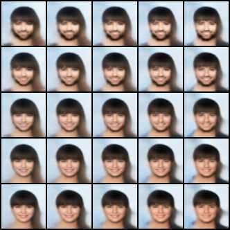
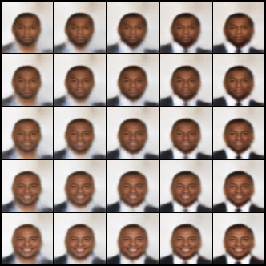
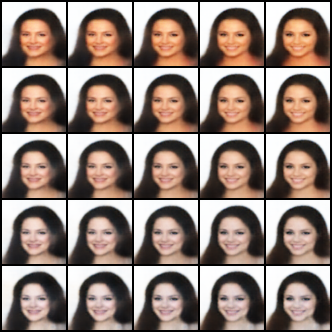

# Capturing label characteristics in VAEs

Offical repository for [Capturing Label Chacteristics in VAEs ICLR 2021](https://openreview.net/pdf?id=wQRlSUZ5V7B). This codebase uses pyro, which some users may not find useful, conseqently we also released a purely pytorch version [here](https://github.com/thwjoy/ccvae_pytorch). We kindly ask that you cite our work if you plan to use this codebase:

    @inproceedings{
        joy2021capturing,
        title={Capturing Label Characteristics in {\{}VAE{\}}s},
        author={Tom Joy and Sebastian Schmon and Philip Torr and Siddharth N and Tom Rainforth},
        booktitle={International Conference on Learning Representations},
        year={2021},
        url={https://openreview.net/forum?id=wQRlSUZ5V7B}
    }

## Dependencies

 * Python 3.6
 * Pytorch 1.8
 * Pyro-ppl 1.5

 ## Usage

 Ensure that CelebA is in the directory `data/datasets/celeba`, such that the path `data/datasets/celeba/celeba/img_align_celeba/*` is accessable. 

 To train, run:

>   `python ss_vay.py -sup <sup-frac> --cuda>`

where `<sup-frac>` is the fraction of supervised data (e.g. 0.004, 0.06, 0.2, 1.0).

## Results

Classification accuracies and latent traversals will be stored in `data/vae_results/f_<sup-frac>`.

